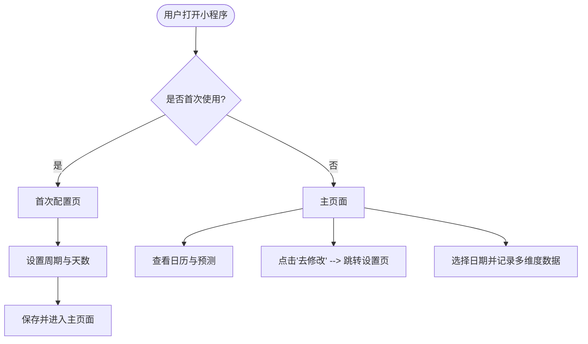

# 经期助手小程序 产品需求文档 (PRD)

| 项目名称 | 经期助手小程序 | 目标平台 | 微信小程序 |
| --- | --- | --- | --- |
| 文档版本 | V1.0.0 | 创建时间 | 2026-07-06 |
| 文档状态 | 草稿 / 待评审 | 撰写人 | Antigravity |

---

## 1. 项目背景与目标

### 1.1 背景介绍
女性生理周期健康是女性日常健康管理的重要组成部分。为了帮助女性用户轻松、科学地记录生理期，预测生理周期，并记录日常的身体和情绪状态，本项目拟开发一款轻量、精美、易用的“经期助手”微信小程序。

### 1.2 产品目标
1. **低门槛上手**：首次使用通过极简的配置步骤快速初始化数据。
2. **精准预测**：通过用户记录的生理周期数据，利用科学的计算公式及动态调整算法，预测下一次月经、排卵日和排卵期。
3. **多维度关怀**：提供覆盖经量、痛经、颜色、分泌物、身体症状、基础体温、体重和情绪的每日多维度记录，帮助用户全方位掌握身体变化。
4. **极致视觉与体验**：界面设计现代、美观、温暖，交互动效流畅自然，使用户在使用时感到舒适与贴心。

---

## 2. 核心用户流程 (User Flows)



---

## 3. 功能详细需求 (Functional Requirements)

### 3.1 首次使用配置页 (First-time Configuration)
* **触发场景**：用户首次打开小程序，且本地/云端无历史配置数据。
* **页面设计要点**：设计风格温馨、纯净，避免繁琐，引导用户聚焦于基础参数的设置。
* **功能要点**：
  1. **参数设置项**：
     * **经期周期**：默认 **28** 天。提供“+”和“-”操作按钮，支持数值的增加和减少（合理范围限制：20 - 45 天）。
     * **经期持续天数**：默认 **5** 天。提供“+”和“-”操作按钮，支持数值的增加和减少（合理范围限制：2 - 15 天）。
  2. **解释文案**：
     * 页面醒目位置展示文案：“*设置经期周期和持续天数，将根据你的设置，为你预测下个月的经期日期*”。
  3. **保存按钮**：
     * 点击“开启经期助手”，保存配置并进入主页面。

---

### 3.2 非首次使用主页面 (Main Dashboard)
* **触发场景**：非首次使用，或完成首次配置后进入。
* **页面组成**：

#### 3.2.1 顶部消息/公告栏
* **展示内容**：日常健康小贴士、今日经期状态预测提醒或系统消息。
* **交互要求**：
  * 右侧提供“关闭”按钮（如 `×` 按钮）。
  * 点击“关闭”后，该消息栏收起，本自然日内不再主动展示，直至下一次有新消息或次日刷新。

#### 3.2.2 日历控件 (Calendar Widget)
* **核心交互**：
  * **年/月切换**：
    * 提供顶部年、月选择器（支持点击弹出 Picker 选择年份与月份）。
    * 支持左右滑动（Swipe）切换月份，滑动时应有流畅的过渡动效。
  * **回今天快捷键**：
    * 当日历展示的非当前真实日期所在的月份时，右上角或底部展示“回今天”快捷按钮。
    * 点击后，日历平滑滚动或瞬间切换回当前年份与月份，并选中“今天”。
  * **标记展示**：
    * 日历的网格上需要根据预测或用户实际记录，以不同的背景色/图标标记出：**月经期**、**预测经期**、**排卵期**、**排卵日**。

#### 3.2.3 颜色图例与名词解释 (Color Legends & Glossary)
* **颜色图例定义**：
  * **月经期**：经典珊瑚粉/暖红色 █（代表已确认来月经的实际天数）
  * **预测经期**：浅粉色/半透明粉 ░（代表算法预测的月经天数）
  * **排卵期**：淡紫色/罗兰紫 █（代表受孕几率较高的窗口期）
  * **排卵日**：深紫色/带闪烁圆点 🟣（代表排卵当天）
* **交互逻辑**：
  * 图例放置于日历下方，呈水平或网格排列。
  * **点击图例中的任意名词（如“排卵期”）**：跳转或弹窗进入【名词解释页面】，向用户科普生理学名词（如：什么是排卵期、如何计算、受孕概率等）。

#### 3.2.4 设置展示与修改入口 (Settings Entry)
* **信息展示**：主页面底部或侧边栏，清晰展示当前用户的配置信息：“*当前设置：平均周期 28 天 / 持续 5 天*”。
* **交互**：
  * 提供“去修改”或“修改设置”的文字链/按钮。
  * 点击后跳转至【设置页面】（可复用首次配置的界面组件，但支持返回主页面，且需要提供“保存”和“取消”操作）。

---

### 3.3 生理期预测逻辑 (Prediction Algorithms)

小程序的预测逻辑基于经典的生理周期计算公式，并支持随着用户持续记录而进行动态优化：

| 项目 | 计算公式 / 业务逻辑说明 |
| --- | --- |
| **周期长度** | 相邻两次月经开始日期的间隔天数（计算公式：$T_{cycle} = D_{start2} - D_{start1}$）。 |
| **下一次月经** | $D_{next\_start} = D_{recent\_start} + T_{average\_cycle}$（最近一次月经开始日期 + 用户平均周期）。 |
| **经期结束** | $D_{end} = D_{start} + T_{period\_length} - 1$（月经开始日期 + 经期天数 - 1）。 |
| **排卵日** | $D_{ovulation} = D_{next\_start} - 14$ 天（基于下一次月经开始日，前推 14 天为排卵日，黄体期通常固定为 14 天）。 |
| **排卵期** | $D_{ovulation\_window} = [D_{ovulation} - 5, D_{ovulation} + 1]$（排卵日前 5 天至排卵后 1 天，共 7 天）。 |
| **历史预测** | 随着记录增加，系统应放弃使用初始静态配置，改用**历史最近 3~6 个周期的加权移动平均值**来更新 $T_{average\_cycle}$ 和 $T_{period\_length}$，最近的周期赋予更高的权重，以提高预测准确度。 |
| **不规则周期** | 若用户周期波动较大（如标准差 $> 3$ 天），系统在日历上标记预测经期时，由单一日期或固定范围扩展为**预测区间**（如：在预测开始日前后给出 $\pm 2 \sim 5$ 天的渐变色区间），并提醒用户加强记录，算法动态收敛。 |

---

## 4. 每日多维度记录需求 (Daily Logger)

用户可以在日历中点击任意一天，展开多维度记录面板。以下为各维度的字段及逻辑要求：

### 4.1 月经开关与闭环逻辑 (Menstrual Status - Closed Loop)
* **字段名称**：月经来喽 / 月经走喽
* **展现形式**：
  * 提供“是”与“否”的选择切换（或滑动开关 Toggle）。
  * 状态文字动态变化：
    * 当未处于经期时，展示“**月经来喽？**”；
    * 当已处于经期且未标记结束时，展示“**月经走喽？**”。
* **闭环逻辑约束（重点）**：
  1. **闭环定义**：一次“月经来喽”（开始）和一次“月经走喽”（结束）构成一个完整的经期闭环，时间线上不能出现交叉。
  2. **逻辑限制**：
    * **不允许连续开始**：在没有记录“月经走喽”之前，系统不允许用户在后面的日期再次记录“月经来喽”。
    * **不允许无始而终**：若用户未曾在之前记录过“月经来喽”，则无法在任何日期直接记录“月经走喽”。
    * **自动补全/校验**：若用户忘记记录“月经走喽”，在下一次记录“月经来喽”时，系统应友好弹窗提示：“*您上一次的月经似乎还没有结束，是否将上一次月经的结束日期设为 [预测结束日]？*”。

### 4.2 经期特征多维度记录
各字段需设计精致的图标（图例），选中时有明显的视觉反馈（如高亮边框、颜色加深、缩放动效）。

| 分类 | 字段 / 选项 | 交互及展现要求 |
| --- | --- | --- |
| **经量** | 极少 ｜ 少 ｜ 中 ｜ 多 ｜ 极多 | 单选。每种经量配以水滴状图标（从一颗水滴渐变到多颗/大水滴）。 |
| **痛经程度** | 完全不痛 ｜ 轻微痛 ｜ 比较痛 ｜ 非常痛 ｜ 痛到极致 | 单选。配以表情符号或程度色彩图标（从绿色笑脸渐变到深红色哭脸/闪电痛感标示）。 |
| **颜色** | 浅红色 ｜ 鲜红色 ｜ 深红色 ｜ 暗红色 ｜ 黑色 | 单选。提供圆点或水滴色彩图例，严格匹配对应的十六进制色值，让用户直观选择。 |
| **分泌物** | 无异味 ｜ 干燥 ｜ 粘稠 ｜ 稀糊状 ｜ 水状 ｜ 蛋清状 | 多选或单选（推荐单选）。配以相对应的性状微缩示意图。 |

### 4.3 身体症状记录
* **交互设计**：提供快速勾选的标签墙（Tag Grid），支持多选。
* **症状分类**：
  1. **头部**：`无不适`（选中后自动互斥清除其他）、`头痛`、`眩晕`、`昏沉`、`发胀`。
  2. **胸部**：`无不适`（互斥）、`胀痛`、`刺痛`、`发硬`、`下坠感`。
  3. **全身症状**：`无不适`（互斥）、`腰酸`、`背痛`、`腹胀`、`腹痛`。

### 4.4 身体数值输入
* **基础体温**：
  * **组件**：数字输入框（支持小数，如 36.5）。
  * **展现**：输入框右侧或占位符内显示单位：**°C**。
* **体重**：
  * **组件**：数字输入框（支持输入整数/小数）。
  * **展现**：输入框右侧显示单位：**斤**。

### 4.5 情绪状态记录
* **选项**：开心 ｜ 一般 ｜ 不开心 ｜ 烦躁 ｜ 易怒
* **交互要求**：
  * 单选。
  * 采用可爱的 Emoji 表情图标，用户点击时带有轻微弹跳或微缩放动效，选中状态伴有情绪主题色高亮。

---

## 5. UI/UX 设计与视觉要求 (Visual Guidelines)

根据高级设计指南，小程序界面应达到以下要求：
1. **配色方案**：
   * **主色调**：温暖柔和的暖沙色（Warm Sand）、珊瑚粉（Coral Pink）和柔和紫（Soft Lavender）。避免使用刺眼、高饱和度的纯红或纯紫。
   * **背景**：采用微渐变、磨砂玻璃效果（Glassmorphism），使界面具有呼吸感和层次感。
2. **字体与排版**：
   * 采用系统无衬线字体，字重分明。日历数字易读性高，重点信息（如“今天”或“经期第一天”）醒目。
3. **动效**：
   * 日历月度切换使用平滑横向滑入滑出。
   * 多维度记录面板采用底部向上弹出的抽屉式设计（Drawer/Action Sheet），伴有缓动曲线（Ease-in-out）。
   * 记录保存成功时展示微弱的成功动画（如小勾勾浮现并渐隐）。

---

## 6. 数据模型设计参考 (Data Models)

### 6.1 用户设置表 (`UserConfig`)
```json
{
  "userId": "string (wx_open_id)",
  "periodCycle": "number (default: 28)",
  "periodDuration": "number (default: 5)",
  "isFirstTime": "boolean (default: true)",
  "createdAt": "timestamp",
  "updatedAt": "timestamp"
}
```

### 6.2 每日记录表 (`DailyRecord`)
```json
{
  "recordId": "string (date_userId)",
  "userId": "string",
  "date": "string (YYYY-MM-DD)",
  "menstrualStatus": "string (none | start | end)", 
  "flow": "string (none | micro | light | medium | heavy | extreme)",
  "pain": "string (none | mild | moderate | severe | extreme)",
  "color": "string (none | light_red | bright_red | deep_red | dark_red | black)",
  "discharge": "string (none | dry | sticky | pasty | watery | egg_white)",
  "symptoms": {
    "head": ["headache", "dizziness"],
    "breast": ["swelling_pain"],
    "body": ["backache"]
  },
  "basalTemperature": "number (unit: °C)",
  "weight": "number (unit: 斤)",
  "emotion": "string (happy | normal | unhappy | annoyed | irritable)",
  "updatedAt": "timestamp"
}
```

---

## 7. 非功能性需求与安全合规 (Non-Functional Requirements)

1. **隐私安全**：
   * 生理数据属于高度个人敏感数据。小程序应遵循微信个人信息保护要求，在初次配置时提供隐私权政策弹窗，获得授权后方可保存数据。
   * 支持本地缓存（Storage）存储，在网络不好时亦可离线记账，网络恢复后同步到云数据库。
2. **性能体验**：
   * 页面加载时间（首次渲染）控制在 1.5 秒以内。
   * 日历滑动切换帧率保持在 60fps，避免卡顿。
