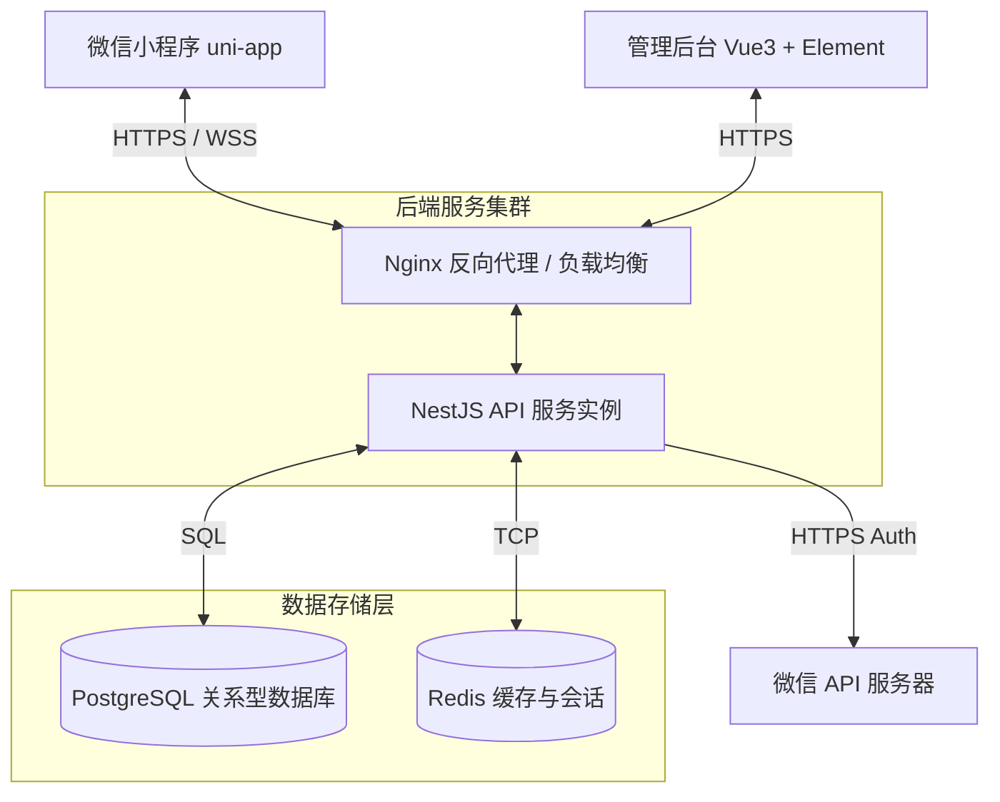
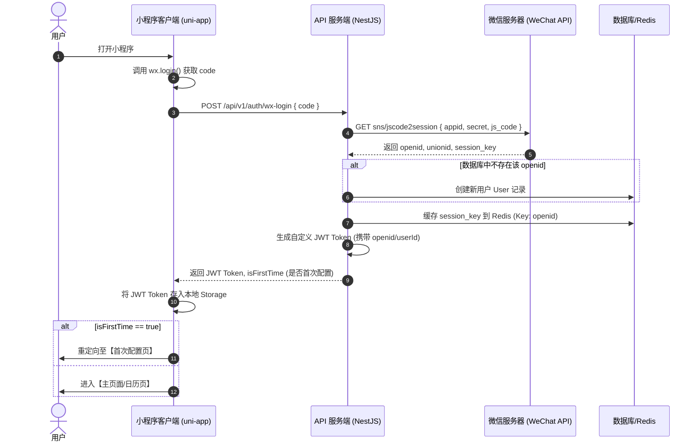

# 经期助手全栈系统设计与技术规范

本设计文档旨在为“经期助手”微信小程序提供完整的技术选型、架构设计、核心时序以及对 PRD 需求的补充设计，指导前后端的开发与部署。

---

## 1. 技术栈选型与框架设计

### 1.1 前端小程序端
*   **开发框架**：**uni-app (Vue 3 + TypeScript + Vite)**
    *   **选用理由**：
        1.  **开发效率高**：采用 Vue 3 Composition API，支持现代组件化开发与响应式数据流。
        2.  **多端复用**：虽初期仅运行于微信小程序，但 uni-app 支持零成本/低成本编译至 H5、支付宝小程序、iOS/Android App，为未来多端拓展打下基础。
        3.  **构建速度快**：使用 Vite 构建引擎，热更新毫秒级响应，显著提升开发体验。
*   **状态管理**：**Pinia**（轻量级、类型安全、完美支持 TypeScript 的状态管理库，用于管理用户配置、登录态及本地临时记录）。
*   **样式库**：**Tailwind CSS (通过 WindiCSS 或 PostCSS 适配小程序)** + **uni-ui**（提供开箱即用的轻量级组件，如 Picker、Drawer、Popup，并通过 Vanilla CSS 自定义磨砂玻璃及微动效样式）。

### 1.2 后端 API 服务端
*   **开发框架**：**Node.js (NestJS + TypeScript)**
    *   **选用理由**：
        1.  **架构清晰**：基于模块化（Modules）、控制器（Controllers）和提供者（Providers）架构，天然支持依赖注入（DI），易于编写单元测试。
        2.  **类型一致性**：前后端统一使用 TypeScript，DTO（数据传输对象）和接口类型可共享，减少沟通及开发偏差。
        3.  **生态丰富**：内置支持 Guards（鉴权）、Interceptors（拦截器）、Pipes（管道验证），可以轻松实现输入校验及异常全局捕获。
*   **数据库 ORM**：**Prisma ORM**（强类型安全，拥有优秀的数据库迁移与模型定义工具）。

### 1.3 数据库与缓存
*   **主数据库**：**PostgreSQL (V15+)**
    *   **选用理由**：由于每日生理记录（DailyRecord）包含多维度的自定义特征（头部症状、胸部症状、全身症状等），且未来可能扩展更多指标，PostgreSQL 强大的 **JSONB** 字段类型非常适合存储此类半结构化数据，既保留了关系型数据库的强一致性，又具备了文档数据库的灵活性。
*   **缓存服务**：**Redis (V7.0+)**
    *   **选用理由**：
        1.  **会话缓存**：存储微信小程序登录态（Session Key, Access Token 和 JWT），加速接口鉴权。
        2.  **预测缓存**：生理周期预测计算开销相对较高，将计算后的预测区间结果存入 Redis 缓存，当用户没有发生数据更新时，日历渲染可直接读取缓存。

### 1.4 后台管理端
*   **开发框架**：**Vue 3 + Vite + Element Plus**
    *   **选用理由**：
        1.  **组件丰富**：Element Plus 提供了完备的后台组件，可快速实现科普名词解释（Glossary）的富文本编辑与 CRUD 管理。
        2.  **体验优秀**：采用单页面应用（SPA）架构，操作响应迅速。

---

## 2. 系统架构设计

### 2.1 整体拓扑架构

### 2.2 微信登录与授权时序

微信小程序使用无感登录模式，通过 `wx.login` 获取临时登录凭证 `code`，并在后端换取 `openid` 和 `session_key`，生成自定义的 JWT 令牌。

---

## 3. PRD 需求补充设计与异常边界处理

为了使小程序更具鲁棒性，针对原 PRD 进行以下深度补充：

### 3.1 用户数据隐私与合规 (GDPR & PII)
1.  **隐私协议授权**：
    *   在首次打开小程序时，必须弹窗展示《隐私权保护政策及用户服务协议》。
    *   用户勾选“同意”后，方可调用 `wx.login` 和后续保存接口。
2.  **数据一键抹除**：
    *   在设置页面中提供“重置所有数据”或“注销账号”选项。
    *   调用 `POST /api/v1/user/reset` 接口，物理删除用户的所有 `DailyRecord` 和 `UserConfig`，并将用户状态设为首次使用。

### 3.2 生理周期算法边界保护与异常处理
生理周期数据因人而异，极易出现异常值。系统须具备以下安全防护机制：
1.  **参数合理值约束**：
    *   平均周期设定范围：必须在 **20 至 45 天** 之间。
    *   经期天数设定范围：必须在 **2 至 15 天** 之间。
2.  **异常长/短周期处理**：
    *   *场景*：若用户由于怀孕、哺乳、药物或身体疾病导致数月未记录，或者一个月内多次标记月经来潮。
    *   *算法处理*：
        *   **异常大值忽略**：在计算“历史平均周期长度”时，如果相邻两次记录的间隔时间大于 60 天（如长期闭经后恢复），系统应在计算移动平均值时**自动剔除**该次异常间隔，避免将平均周期拉长至 40-50 天导致后续预测完全失准。
        *   **异常小值合并**：如果两次月经开始日期相隔小于 15 天，系统自动将其标记为“异常出血”或“排卵期出血”，不计入正常的月经周期计算，并向用户发送健康提示。
3.  **计算安全兜底**：
    *   如果用户清空了所有历史记录，或历史有效周期样本不足 1 个，系统将自动回退到使用 `UserConfig` 中的默认静态设置（即默认的 28 天和 5 天）进行下个月的经期预测。

### 3.3 离线数据同步机制 (Offline Synchronization)
为了满足用户在无网络状态下的记账需求：
1.  **本地暂存**：
    *   当网络请求失败（如报 502/504/网络连接断开）时，uni-app 会将当前修改的数据追加保存到小程序的本地缓存（`wx.setStorage`），并标记一条同步状态标志 `synced = false`。
2.  **联网重试/增量同步**：
    *   每次小程序启动时，或网络连接恢复（监听 `wx.onNetworkStatusChange`）时，检测本地是否存在 `synced = false` 的记录。
    *   若存在，采用“**客户端最新时间戳优先**”的合并策略（Client-Wins with Timestamps），将本地未同步的数据批量发送至 `POST /api/v1/records/sync` 进行云端增量更新，更新完毕后清除本地待同步标记。
